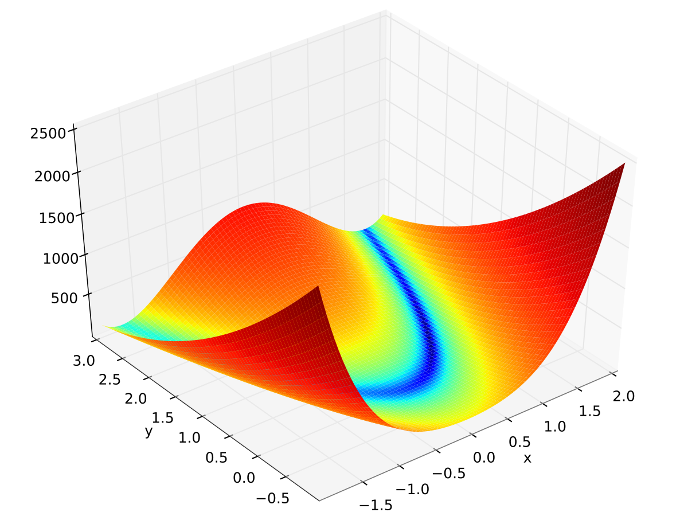
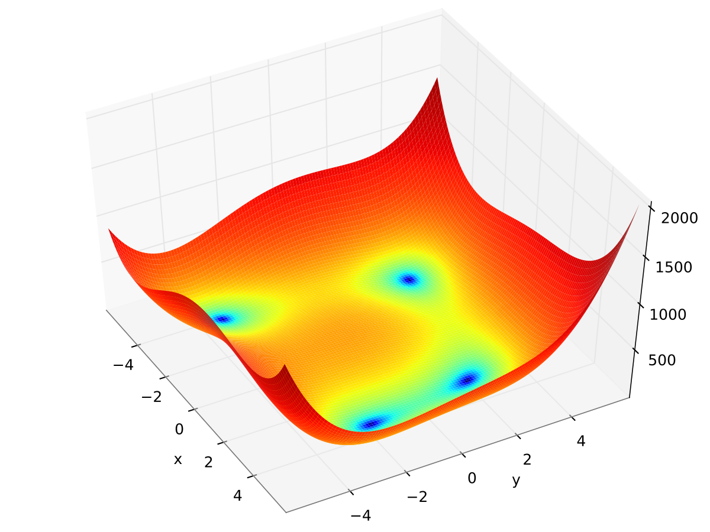

# Optimisation Methods C++
Prescription: Nelder–Mead method, Gradient method, Conjugate gradient method, Quazi-Newton method

Hi, I am student of SPbU, AMCP faculty. This is my work of Optimisation methods class.
I tested methods on two popular functions for testing - Rosenbrock and Himmelblau. You can see it on pictures.

You can use it by yourself, because it works well, all you need to change functions to which you need. 
Also you can write me with questions to my VK profile https://vk.com/nyshny or egor322129@gmail.com

